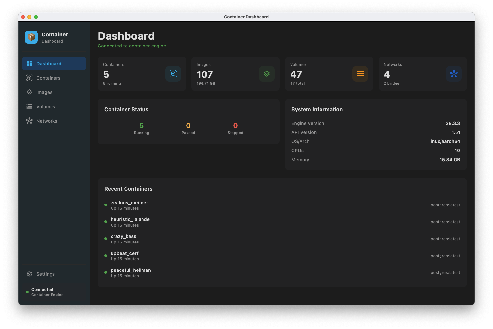
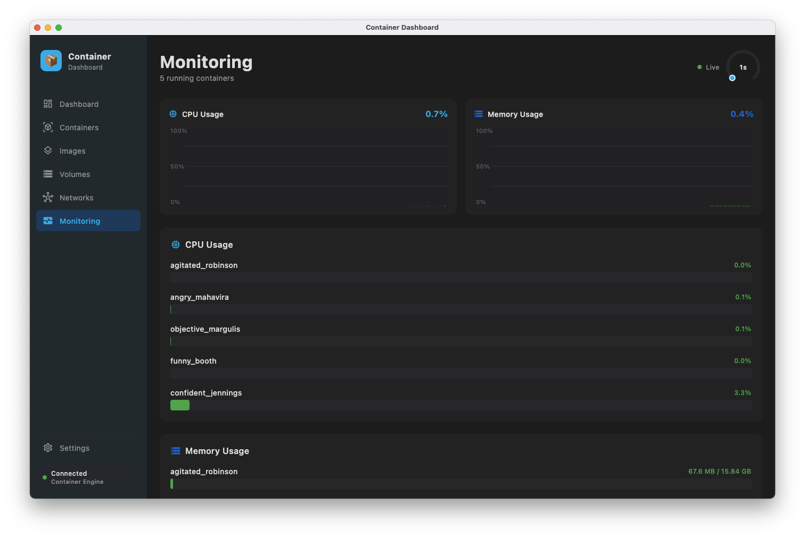

# Container Dashboard

A container management dashboard built with **Jetpack Compose Multiplatform**. This application provides interface to manage your containers, images, volumes, and networks.

The app have been done using Claude Opus 4.5 and 4.6.


## Features

- 📊 **Dashboard** - Overview of your container environment with statistics
- 📦 **Containers** - List, start, stop, pause, and manage containers
- 🖼️ **Images** - View, pull, and manage container images
- 💾 **Volumes** - Create and manage persistent data volumes
- 🌐 **Networks** - Configure and manage networks
- 📈 **Monitoring** - Real-time CPU and memory usage monitoring with live graphs and detailed stats per container
- ⚙️ **Settings** - Configure application preferences and engine connection

## Screenshots




The application features :

- Sidebar navigation with branding and connection status indicator
- Statistics cards with real-time data
- Searchable and filterable data tables
- Status badges with color-coded container states (running, stopped, paused, etc.)
- Action buttons for common container operations
- Live CPU and memory usage graphs with adjustable refresh rate
- Container logs viewer in a resizable sliding pane
- Three-pane layout with draggable dividers
- Material3 dark theme

## Project Structure

```
composeApp/
├── src/
│   ├── commonMain/kotlin/com/containerdashboard/
│   │   ├── data/
│   │   │   ├── models/          # Data models (Container, Image, Volume, Network)
│   │   │   └── repository/      # Docker API repository interface
│   │   ├── ui/
│   │   │   ├── components/      # Reusable UI components
│   │   │   ├── navigation/      # Navigation definitions
│   │   │   ├── screens/         # Screen composables
│   │   │   └── theme/           # Material3 theme configuration
│   │   └── App.kt               # Main application composable
│   └── desktopMain/kotlin/com/containerdashboard/
│       └── Main.kt              # Desktop entry point
```

## Tech Stack

- **Kotlin Multiplatform** - Share code across platforms
- **Jetpack Compose Multiplatform** - Modern declarative UI framework
- **Material3** - Latest Material Design components
- **Ktor Client** - HTTP client for API communication
- **Kotlinx Serialization** - JSON serialization for API responses
- **Kotlinx Coroutines** - Asynchronous programming

## Getting Started

### Prerequisites

- JDK 17 or higher
- Gradle 8.14 or higher (included via wrapper)
- Container engine installed and running (for full functionality)

### Build & Run

1. Clone the repository:
```bash
git clone https://github.com/yourusername/container-dashboard.git
cd container-dashboard
```

2. Run the desktop application:
```bash
./gradlew :composeApp:run
```

3. Build distribution packages:
```bash
# macOS
./gradlew :composeApp:packageDmg

# Windows
./gradlew :composeApp:packageMsi

# Linux
./gradlew :composeApp:packageDeb
```

## Configuration

### Supported Container Engines

The application auto-detects the Docker socket at startup, probing common locations in order:

| Engine | Socket Path |
|--------|------------|
| Docker Desktop (standard) | `/var/run/docker.sock` |
| Colima | `~/.colima/default/docker.sock` |
| Docker Desktop (newer) | `~/.docker/run/docker.sock` |
| OrbStack | `~/.orbstack/run/docker.sock` |
| Lima | `~/.lima/default/sock/docker.sock` |
| Rancher Desktop | `~/.rd/docker.sock` |

The first socket that exists on disk is used as the default. You can also select or type a custom engine host in **Settings > Container Engine** using the editable dropdown, then click **Save & Reconnect** to apply without restarting the app.

If the container engine is not running at launch, the app shows a waiting screen with a **Settings** button so you can configure the connection before the engine starts.

### Custom Hosts

Besides Unix sockets, you can configure:

- **TCP**: `tcp://localhost:2375`
- **TLS**: `tcp://localhost:2376` (with certificates)

## Development

### Adding a New Screen

1. Create a new screen composable in `ui/screens/`
2. Add the screen to `Screen` enum class in `ui/navigation/Navigation.kt`
3. Add navigation case in `App.kt`

### Implementing Container API

The `DockerRepository` interface in `data/repository/` defines all container operations. To connect to a container engine:

1. Implement the `DockerRepository` interface using your preferred client
2. Connect to the API via Unix socket or TCP
3. Replace `MockDockerRepository` with your implementation

## License

This project is licensed under the MIT License - see the [LICENSE](LICENSE) file for details.

## Acknowledgments

- Built with [Compose Multiplatform](https://www.jetbrains.com/lp/compose-multiplatform/)
- Icons from [Material Icons](https://fonts.google.com/icons)
